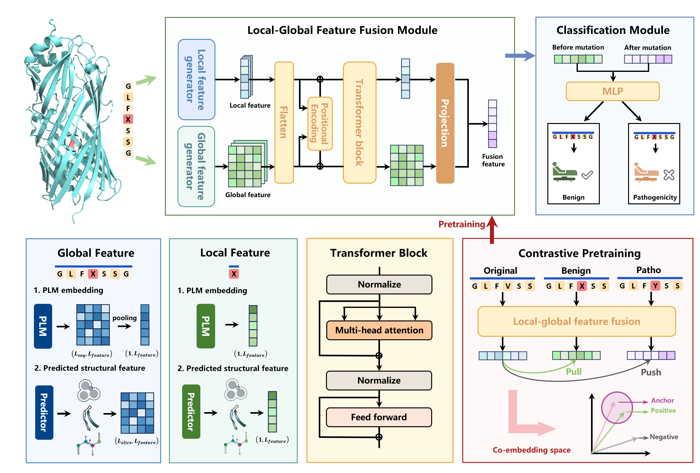

# Memo-Patho
Bridging Local-Global Transmembrane Protein Contexts with Contrastive Pretraining for Alignment-Free Pathogenicity Prediction

<p align="center"></p>

## Environment
```shell
python                    3.11.0
numpy                     2.1.3
nvidia-cudnn-cu12         8.9.2.26
nvidia-nccl-cu12          2.20.5
pandas                    2.2.3
scikit-learn              1.6.1
scipy                     1.15.1
torch                     2.3.1+cu121
torchaudio                2.3.1+cu121
torchvision               0.18.1+cu121
```
## Running interface
> Step 1: prepare running environment  
```shell
git clone https://github.com/RoarBoil/Memo-Patho.git
cd Memo-Patho
conda env create -n memo -f memo.yaml
source activate memo
```
> Step2: prepare your dataset (skip this if directly test on the processed dataset)  

first enter the 'preprocess_feature_generation' directory
```shell
cd preprocess_feature_generation/preprocessed_feature
```
prepare the format like this and change the name to mutation_dataset.csv (note that the position starts from 1)
```Plain Text
accession, sequence, begin, wildType, mutatedType, clinicalSignificances
A0A6Q8PFI8, xxx, 1, M, A, 0
```
> Step 3: prepare the PLMs environment (skip this if directly test on the processed dataset)  
------------------
**ESM**  
follow the instructions in [ESM](https://github.com/facebookresearch/esm)  
in this work we use [esm2_t36_3B_UR50D](https://dl.fbaipublicfiles.com/fair-esm/models/esm2_t36_3B_UR50D.pt)  
create this conda environment as 'esm' then 
```shell
pip install fair-esm
```
--------------------

**ProtT5**  
follow the instructions in [ProtTrans](https://github.com/agemagician/ProtTrans)  
in this work we use [ProtT5-XL-UniRef50](https://huggingface.co/Rostlab/prot_t5_xl_uniref50/tree/main)  
create this conda environment as 'protT5' then 
```shell
pip install torch
pip install transformers
pip install sentencepiece
```
--------------------

**NetSurfP-3.0**  
follow the instructions in [NetSurfP-3.0](https://github.com/Eryk96/NetSurfP-3.0)  
create this conda environment as 'nsp3'
```shell
git clone https://github.com/Eryk96/NetSurfP-3.0.git
conda env create --file environment.yml
conda activate nsp3
cd nsp3
python setup.py install
```
> Step 4: prepare the features (skip this if directly test on the processed dataset)  

enter the 'preprocess_feature_generation' directory
```shell
cd preprocess_feature_generation
```
**generate the dictionaries for middle result**
```shell
conda activate memo
python step1.py
```
--------------------
**sequence preprocess**
```shell
sh auto_generate_dir.sh
```
--------------------
**generate esm2 features**
```shell
conda activate esm
python generate_ESM.py
```
--------------------
**generate protT5 features**
```shell
conda activate protT5
python generate_T5.py
```
--------------------
**generate NetSurfP-3.0 features** (suppose the NetSurfP-3.0 is located at tools/NetSurfP-3.0_standalone)
```shell
python generate_netSurfP_1.py
```
then
```shell
cd ../tools/NetSurfP-3.0_standalone
conda activate nsp3
sh before.sh
sh after.sh
```
aggregate the NetSurfP-3.0 features
```shell
cd ../preprocess_feature_generation
python generate_netSurfP_2.py
```
--------------------
**combine all features**
```shell
conda activate memo
python step3.py
```
You can now find the preprocessed dataset at preprocess_feature_generation/preprocessed_feature/final_preprocessed_result.pkl  
Note that you should first check the repeated records in the dataset and remove them

> Step 5: train the model (if you want to train your own model)
You should first prepare your own triplet dataset
```shell
python pretrain.py
```
then save your pretrained model weights  
load the pretrained model weights
```shell
python train.py
```
> Step 6: test the model

download the model weight as model_weight/final_model.pth
download the dataset as dataset/test_mix.pkl
```shell
python test.py
```

## Processed dataset and model weights
| model tyoe |                                trained weights                                 |                                 training data                                  |                                  test data                                   |
|:----------:|:------------------------------------------------------------------------------:|:------------------------------------------------------------------------------:|:----------------------------------------------------------------------------:|
|    mix     | [Download](https://www.psymukb.net:83/Memo_Patho_Download/mix/final_model.pth) | [Download](https://www.psymukb.net:83/Memo_Patho_Download/mix/train_mix.fasta) | [Download](https://www.psymukb.net:83/Memo_Patho_Download/mix/test_ind.pkl)  |
|    ind     |  [Download](https://www.psymukb.net:83/Memo_Patho_Download/ind/ind_model.pth)  | [Download](https://www.psymukb.net:83/Memo_Patho_Download/ind/train_ind.fasta) | [Download](https://www.psymukb.net:83/Memo_Patho_Download/ind/test_ind.pkl) |

